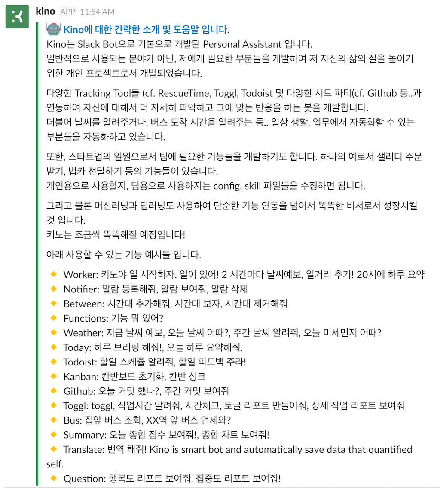
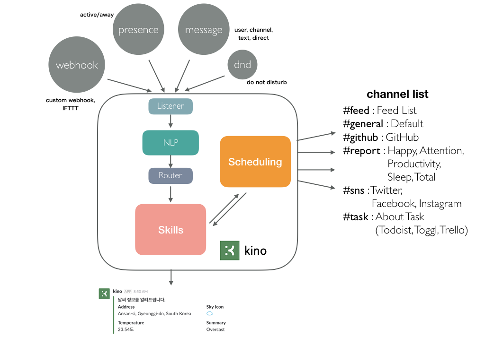
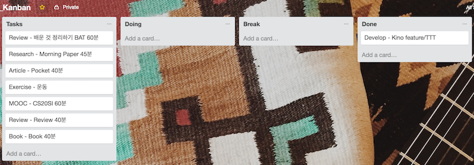
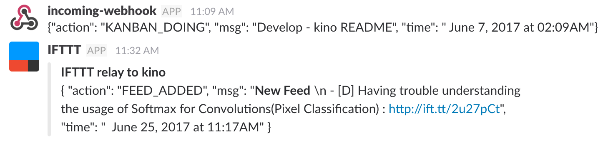

  

  <strong>
    Personal Assistant Based on Slack Bot for Developer  
    Suitable for personal or small teams
  </strong>

  
  
  

### Publication

 - SlideShare : [Slideshare - Kino - My Personal Assistant (개인용 Slack Bot을 통한 Quantified Self 프로젝트)](https://www.slideshare.net/DongJunLee6/kino-my-personal-assistant-slack-bot-quantified-self)

## Introduce
 

## Simple Architecture

## Guide & Install

- [install.md](install.md) 에서 확인할 수 있습니다.

## Prerequisites

- **[Slack](https://slack.com/)**
- **Python 3.6**
- [Open API TOKENs](#open-api)

## Components

### 0. Scheduler

기본 기능으로서 사용자가 설정한 시간대에 작업을 추가할 수 있습니다.  
가능한 작업의 종류는 아래와 같습니다.

- **특정 시간**에 작업 ex) 키노야 일거리! 8시에 하루 브리핑 해줘
- **반복 주기**로 작업 ex) 키노야 일거리! 67분 마다 에 행복도 조사!

그 외에도 **시간대** 추가, 삭제가 가능하며, **알람** 추가, 삭제가 가능합니다.  
알람에 마지막에 해당 스케쥴에 어떤 작업을 진행할지 **Skill**을 추가합니다.

### 1. Skills

다양한 스킬을 구현하여, 사용할 수 있습니다. 현재까지 구현하여 사용되고 있는 스킬은 다음과 같습니다.

### 2. Tracking

#### 2-1 Sleep Time

Slack에는 상태를 표시하는 로그가 있습니다. (active / away)  
이 로그를 통해서 가장 늦게 away 한 시간과 아침에 active한 시간을 이용해서 수면 시간을 추정합니다.  
개발자분들이라면 하루의 시작과 끝은 컴퓨터와 함께일 것이라는 가정입니다!

#### 2-2 Working Hour
- [IFTTT](https://ifttt.com) 와 연동하는 작업이 필요합니다.

IFTTT에는 Android Device 로 Trigger를 줄 수 있습니다. 그 중에서 특정 Wifi에 접속 혹은 접속을 끊었을 때도 가능합니다. 원리는 간단합니다. 회사의 Network에 접속하면 일 시작. 밤에 가장 늦게 접속이 끊긴 시간이 퇴근 시간 입니다.

#### 2-3 Task (Kanban)

Agile의 한 방법론인 Kanban을 Todoist, Toggl, Trello를 연동하여 사용할 수 있습니다.

- Doing : 작업 시작 (toggl timer 자동 실행)
- Break : 작업 중지 (toggl timer 자동 멈춤)
- Done : 작업 중지 (toggl timer 자동 멈춤 & todoist 작업 완료)

해당 작업이 끝나면 집중도를 체크하게 됩니다.

#### 2-4 Happy & Attention Score

저는 일정 시간을 주기로 반복해서 행복도를 물어보도록 설정하였습니다.   
총 100점 만점으로 점수를 입력해주면 되고, 이를 기반으로 행복도 리포트, 종합 점수등을 계산할 수 있습니다. 

### 3. Total Score

Kino의 가장 주 임무는 자신에 대한 데이터를 수집하고, 그 데이터를 통해서 삶의 질을 높이는 것입니다.  
여기서 작용하는 기준은 아래와 같습니다.  

- 수면시간 7시간 이상
- 행복도 점수
- 생산성 점수 (Todoist, Toggl, Github (commit), RescueTime
- 일기
- 운동
- 반복되는 작업 (강의듣기, 좋은 Article 읽기, 책 읽기 등..)

각 점수에 대한 비율을 주어 오늘 하루에 대한 최종 점수를 부여합니다.  
ex) Total Score = sleep(20) + happy(30) + productivity(30) + diary(5) + exercise(5) + repeat(10)

### 4. Webhook
- [IFTTT](https://ifttt.com) 와 연동하는 작업이 필요합니다.
- Custom Webhook [kino-webhook](https://github.com/DongjunLee/kino-webhook) for RealTime (IFTTT은 실시간이 아닙니다)

IFTTT와 연결하여 알 수 있는 정보들

- 특정 장소에 출발/도착 했을때 (집, 회사)
- 새로운 Tweet가 올라왔을 때
- Google Event 가 추가되었을 때
- Google Event 시작 15분 전
- Todoist에 Task가 추가되었을 때
- Todoist에 Task를 완료되었 때
- Pocket에서 제대로 읽고 싶은 아티클을 즐겨찾기 했을 때
- RescueTime에서 하루 Summary를 받을 때 
- 등등...

이런 다양한 경우를 Kino에 연결하여 알림을 받도록 할 수 있습니다. 

### 5. Channel

개인용으로 kino를 사용하는 경우, channel을 각 목적에 맞게 사용하게 됩니다.

- \#feed : 등록한 feed 에 대해서 새로운 글이 포스팅되면 알림을 받습니다. cf) [awesome-feeds](https://github.com/DongjunLee/awesome-feeds)
- \#general : 기본 채널
- \#report : Kino가 수집한 데이터에 대한 리포트에 대한 채널
- \#sns : Twitter, Facebook, Instagram 등 SNS서비스 채널
- \#task : 작업에 관련된 내용에 대한 알림을 받는 채널입니다. (Todoist, Toggl, Trello 등)

## Open API

- **Github**
	- [PyGithub](https://github.com/PyGithub/PyGithub)
- **Weather**
	- [python-forecast.io](https://github.com/ZeevG/python-forecast.io)
	- [geoopy](https://github.com/geopy/geopy)
- **Todoist**
	- [todoist-python](https://github.com/Doist/todoist-python)
- **Toggl**
	- [TogglPy](https://github.com/DongjunLee/TogglPy) forked from [matthewdowney/TogglPy](https://github.com/matthewdowney/TogglPy)
- **Trello**
	- [py-trello](https://github.com/sarumont/py-trello)
- **RescueTime**
- **공공데이터 버스도착정보**
- **공공데이터 대기질정보**
	- [airkoreaPy](https://github.com/DongjunLee/airkoreaPy)
- **Naver 기계번역**
