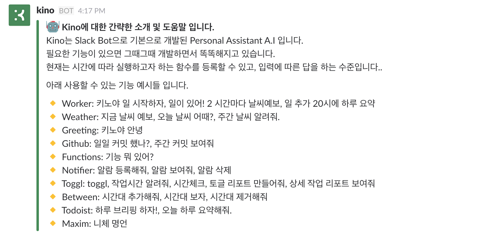
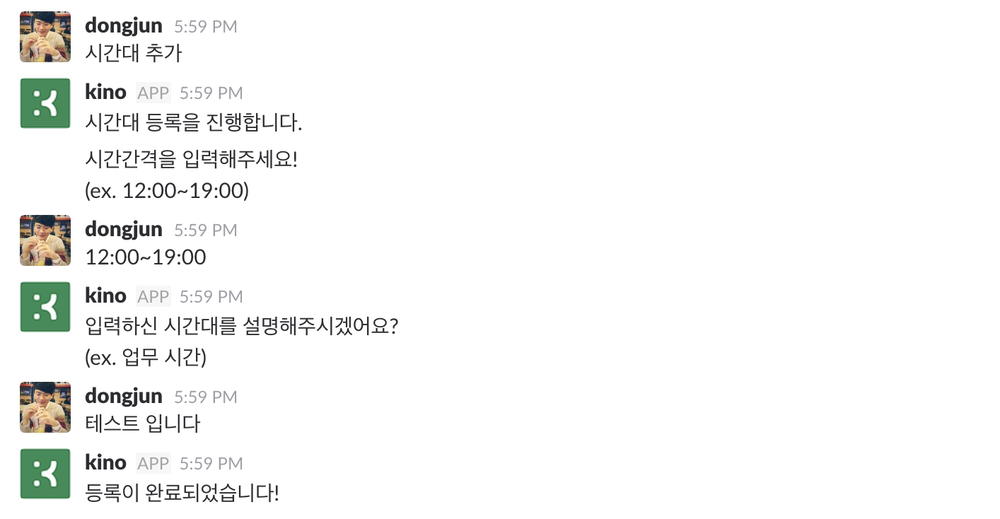
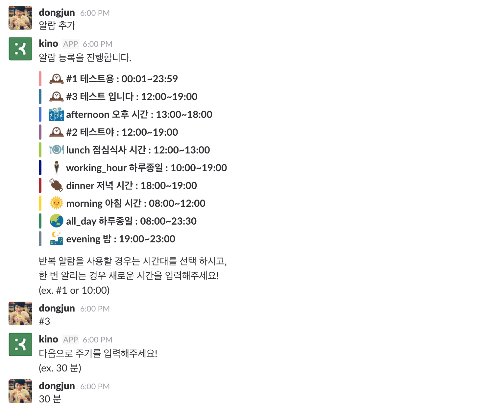
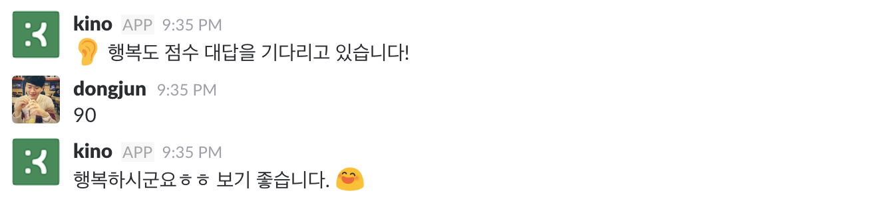
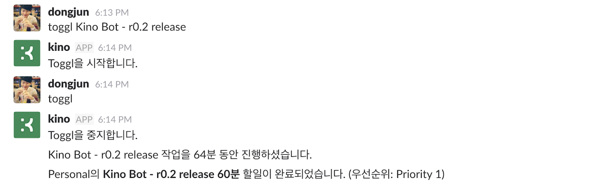
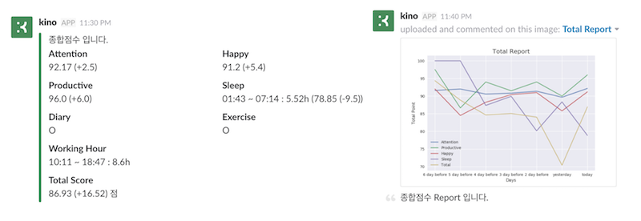
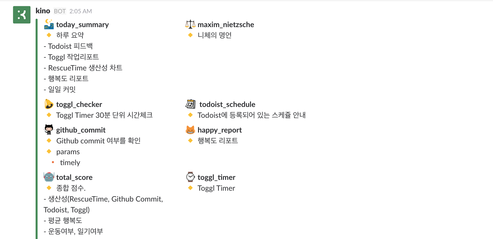
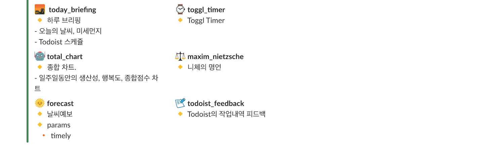

  

  

<h1 align="center"> kino-bot </h1>
<h3 align="center">
  <strong>
    A.I Personal Assistant Based on Slack Bot
  </strong>
</h3>

  
  
  

## Introduce
 
 Kino는 Slack Bot으로 기본으로 개발된 Personal Assistant 입니다. 일반적으로 사용되는 분야가 아닌, 저에게 필요한 부분들을 개발하여 저 자신의 삶의 질을 높이기 위한 개인 프로젝트 (BeHappy Project) 입니다. 다양한 Tracking Tool들 (cf. [RescueTime](https://www.rescuetime.com/), [Toggl](https://toggl.com/), [Todoist](https://www.todoist.com/)) 및 다양한 서드 파티(cf. [Github](https://github.com/) 와 연동하여 자신에 대해서 더 자세히 파악하고 그에 맞는 반응을 하는 봇을 개발합니다. 
 
 물론 머신러닝과 딥러닝도 사용하여 단순한 기능 연동을 넘어서 똑똑한 비서로서 성장시킬 것 입니다. 현재로서는 간단하게 [scikit-learn](http://scikit-learn.org/stable/) 적용해보고 있는 상황입니다.
 
  
 - [Slideshare - Kino - My Personal Assistant (개인용 Slack Bot을 통한 Quantified Self 프로젝트)](https://www.slideshare.net/DongJunLee6/kino-my-personal-assistant-slack-bot-quantified-self)

## Guide

## Prerequisites

- **개인용 [Slack](https://slack.com/)**
- **Python 3.6**
- [asyncio](https://docs.python.org/3/library/asyncio.html)
- [slacker](https://github.com/os/slacker)
- [konlpy](http://konlpy.org/en/v0.4.4/)
- [arrow](https://github.com/crsmithdev/arrow)
- [schedule](https://github.com/DongjunLee/schedule) forked from [dbader/schedule](https://github.com/dbader/schedule) (run the scheduler in a different thread)

## Components

### 0. Scheduler

기본 기능으로서 사용자가 설정한 시간대에 작업을 추가할 수 있습니다.  
가능한 작업의 종류는 아래와 같습니다.

- **특정 시간**에 작업 ex) 키노야 일거리! 8시에 하루 브리핑 해줘
- **반복 주기**로 작업 ex) 키노야 일거리! 67분 마다 에 행복도 조사!

그 외에도 **시간대** 추가, 삭제가 가능하며, **알람** 추가, 삭제가 가능합니다.

이후 등록된 Skill 추가

### 1. Tracking

#### 1-1 Sleep Time

Slack에는 상태를 표시하는 로그가 있습니다. (active / away)  
이 로그를 통해서 가장 늦게 away 한 시간과 아침에 active한 시간을 이용해서 수면 시간을 추정합니다.  
개발자분들이라면 하루의 시작과 끝은 컴퓨터와 함께일 것이라는 가정입니다!

#### 1-2 Working Hour
- [IFTTT](https://ifttt.com) 와 연동하는 작업이 필요합니다.

IFTTT에는 Android Device 로 Trigger를 줄 수 있습니다. 그 중에서 특정 Wifi에 접속 혹은 접속을 끊었을 때도 가능합니다. 원리는 간단합니다. 회사의 Network에 접속하면 일 시작. 밤에 가장 늦게 접속이 끊긴 시간이 퇴근 시간 입니다.

#### 1-3 Happy Score

저는 일정 시간을 주기로 반복해서 행복도를 물어보도록 설정하였습니다. 총 100점 만점으로 점수를 입력해주면 되고, 이를 기반으로 행복도 리포트, 종합 점수등을 계산할 수 있습니다. 

### 2. Toggl + Todoist

To do list를 관리하는 도구로서 [Todoist](https://ko.todoist.com/) 를 즐겨 쓰고있는 분들을 위한 기능입니다. 시간을 트랙킹하는 [Toggl](https://toggl.com/) 과 연동하여, 지정한 시간동안 작업을 해야 Todoist에 등록된 작업을 완료할 수 있습니다. 

ex) [Todoist] Book 45분 => [kino] toggl Book (Book 작업시작) => (45분 후) [kino] toggl => [Todoist] Book 작업 완료 

### 3. Total Score

Kino의 가장 주 임무는 자신에 대한 데이터를 수집하고, 그 데이터를 통해서 삶의 질을 높이는 것입니다.  
여기서 작용하는 기준은 아래와 같습니다.  

- 수면시간 7시간 이상
- 행복도 점수
- 생산성 점수 (Todoist, Toggl, Github (commit), RescueTime
- 일기
- 운동
- 반복되는 작업 (강의듣기, 좋은 Article 읽기, 책 읽기 등..)

각 점수에 대한 비율을 주어 오늘 하루에 대한 최종 점수를 부여합니다.  
ex) Total Score = sleep(20) + happy(30) + productivity(30) + diary(5) + exercise(5) + repeat(10)

### 4. Notifier
- [IFTTT](https://ifttt.com) 와 연동하는 작업이 필요합니다.

IFTTT와 연결하여 알 수 있는 정보들

- 특정 장소에 출발/도착 했을때 (집, 회사)
- 새로운 Tweet가 올라왔을 때
- Google Event 가 추가되었을 때
- Google Event 시작 15분 전
- Todoist에 Task가 추가되었을 때
- Todoist에 Task를 완료되었 때
- Pocket에서 제대로 읽고 싶은 아티클을 즐겨찾기 했을 때
- RescueTime에서 하루 Summary를 받을 때 
- 등등...

이런 다양한 경우를 Kino에 연결하여 알림을 받도록 할 수 있습니다. 

## Features

## Open API

- **Github** : 일일커밋, 주간 커밋
	- [PyGithub](https://github.com/PyGithub/PyGithub)
- **Weather** : 현재 날씨, 오늘의 날씨, 주간 날씨
	- [python-forecast.io](https://github.com/ZeevG/python-forecast.io)
	- [geoopy](https://github.com/geopy/geopy)
- **Todoist** : 하루 브리핑, 할일 피드백
	- [todoist-python](https://github.com/Doist/todoist-python)
- **Toggl** : toggl (작업기록), 주간 작업 리포트
	- [TogglPy](https://github.com/DongjunLee/TogglPy) forked from [matthewdowney/TogglPy](https://github.com/matthewdowney/TogglPy)
- **RescueTime** : 생산성 차트
	- [TogglPy](https://github.com/DongjunLee/TogglPy) forked from [matthewdowney/TogglPy](https://github.com/matthewdowney/TogglPy)
- **공공데이터 버스도착정보** : 버스 도착 시간 조회
- **공공데이터 대기질정보** : 공기질 조회
	- [airkoreaPy](https://github.com/DongjunLee/airkoreaPy)
- **Naver 기계번역** : 영한 번역