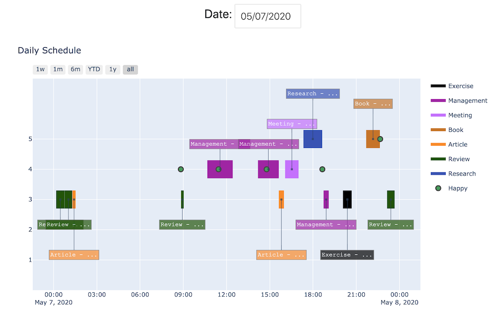
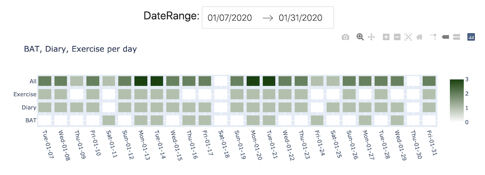
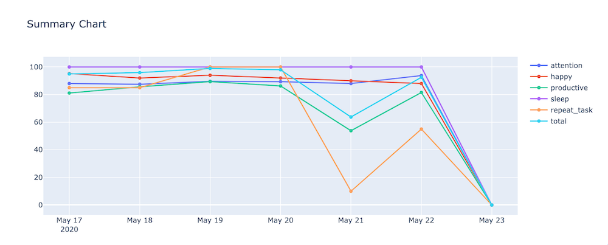
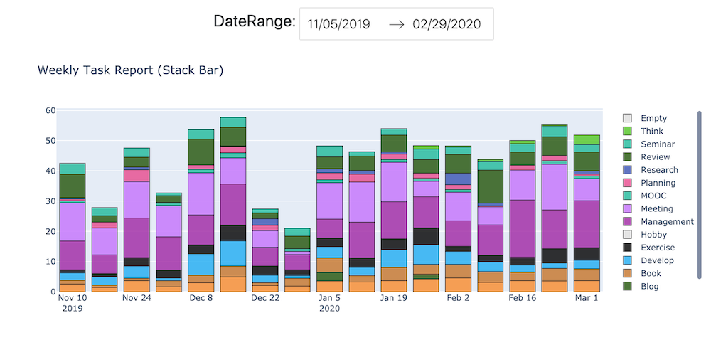

# Quantified Self

<p align="center"><p align="center">

  <a href="https://travis-ci.org/badges/shields">
    
  </a>

  <a href="https://requires.io/github/DongjunLee/kino-bot/requirements/?branch=develop">
    
  </a>

  <br/>

  <a href="https://codecov.io/gh/DongjunLee/kino-bot">
    
  </a>

  <a href="https://github.com/ambv/black">
    
  </a>

  <a href="https://www.codacy.com/app/humanbrain.djlee/kino-bot?utm_source=github.com&utm_medium=referral&utm_content=DongjunLee/kino-bot&utm_campaign=badger">
    
  </a>

</p>


[Quantified Self](https://quantifiedself.com/) 란 개인의 일상활동에서 신체적·정신적 상태를 센싱 및 트래킹하여 이를 수치화함으로써 자신의 상태를 분석하고 삶의 질을 개선하기 위한 방법을 연구하여 실생활에 적용하는 활동을 의미합니다. Gary Wolf와 Tom Kelly에 의해 소개되었으며, 2010년 [Ted Talk](https://www.ted.com/talks/gary_wolf_the_quantified_self?language=ko)에서 주목을 받아, 그 이후 하나의 운동형태로 커뮤니티가 형성되어 QS 웹사이트를 통해 전개되어 왔다고 합니다. 그들의 미션은 다음과 같습니다.

> To improve quality of life by generating and sharing knowledge on Quantified Self (QS)

이 저장소에서는 저 자신에 대한 다양한 데이터들을 수집하고, 분석에 사용했던 코드들과 인사이트를 공유합니다.


### Blog

| Article - Title                                     | English                                                      | Korean                                                       |
| --------------------------------------------------- | ------------------------------------------------------------ | ------------------------------------------------------------ |
| Personal Assistant Kino Part 1 — Overview.          | [Medium](https://medium.com/@humanbrain.djlee/personal-assistant-kino-part-1-overview-496b97de4afd) | [Github page](https://dongjunlee.github.io/quantified self/Personal_Assistant_Kino_Part_1_Overview/) |
| Personal Assistant Kino Part 2 - Skill & Scheduler. | [Medium](https://medium.com/@humanbrain.djlee/personal-assistant-kino-part-2-skill-scheduler-3cf25070fe8e) | [Github page](https://dongjunlee.github.io/quantified self/Personal_Assistant_Kino_Part_2_Skill_and_Scheduler/) |
| Personal Assistant Kino Part 3 - T3.                | [Medium](https://medium.com/@humanbrain.djlee/personal-assistant-kino-part-3-t3-d078b65462be) | [Github page](https://dongjunlee.github.io/quantified self/Personal_Assistant_Kino_Part_3_T3/) |
| Personal Assistant Kino Part 4 - Smart Feed.        | [Medium](https://hackernoon.com/personal-assistant-kino-part-4-smart-feed-b9e4cab966) | [Github page](https://dongjunlee.github.io/quantified self/Personal_Assistant_Kino_Part_4_Smart_Feed/) |


## Data Source

현재 수집하는 데이터의 종류와 사용되는 App과 웨어러블 기기의 리스트입니다.

### Record

Record는 제 자신에 대한 각종 데이터를 수집하고 분석하기 위한 용도입니다.

| Data         | Value                                                        | Description                                                  | Integration                                                  | Note                                                         |
| ------------ | ------------------------------------------------------------ | ------------------------------------------------------------ | ------------------------------------------------------------ | ------------------------------------------------------------ |
| Happy        | 1점 :rage:, 2점 :pensive:, 3점 :slightly_smiling_face:, 4점 :laughing:, 5점 :heart_eyes: | 질문을 받은 당시의 행복도 지수                               |                                                              |                                                              |
| Attention    | 1점 :weary:, 2점 :disappointed:, 3점 :neutral_face:, 4점 :thinking:, 5점 :thumbsup: | 하나의 작업을 끝냈을 때의 집중도 지수                        |                                                              |                                                              |
| Sleep        | 시작시간, 끝시간                                             | 수면시간 데이터                                              | [Fitbit](https://www.fitbit.com/us/home)                     | [python-fitbit](https://github.com/orcasgit/python-fitbit)   |
| Productivity | RescueTime, Github, Toggl, Todoist 종합                      | 생산성 종합 점수                                             | 아래 참고                                                    |                                                              |
| - Task       | Toggl ID, 시작시간, 끝시간, 카테고리, 작업내용, 집중도       | 하나의 작업에 대한 데이터                                    | [Toggl](https://toggl.com/), [Todoist](https://todoist.com/ko), [Trello](https://trello.com/) | [TogglPy](https://github.com/matthewdowney/TogglPy), [todoist-python](https://github.com/Doist/todoist-python), [py-trello](https://github.com/sarumont/py-trello) |
| - RescueTime | 생산성 점수                                                  | Website, App 등의 Time-Tracking Tool                         | [RescueTime](https://www.rescuetime.com/)                    |                                                              |
| - Github     | 주간커밋                                                     | Github의 커밋 수                                             | [Github](https://github.com/)                                | [PyGithub](https://github.com/PyGithub/PyGithub)             |
| Repeat Task  | Exercise, BAT, Diary                                         | 매일 반복하는 활동들<br />(운동, 공부정리, 일기)             |                                                              |                                                              |
| Total Score  | 종합점수                                                     | Attention, Productive, Happy, Sleep, Repeat Task 를 모두 고려한 종합 점수 |                                                              |                                                              |

### Log

Log는 ML 학습을 통해서 자동화를 시키기 위한 데이터 목록입니다.

| Data     | Value                            | Description                                                  | Note                                                         |
| -------- | -------------------------------- | ------------------------------------------------------------ | ------------------------------------------------------------ |
| Message  | 시간, 명령어 텍스트              | kino (Chatbot) 에게 시킨 명령어 텍스트                       |                                                              |
| RSS Feed | Category, Title, Pocket 저장여부 | 다양한 Article 에 대한 데이터<br />자세히 보고 싶은 글의 경우 [Pocket](https://getpocket.com/)에 저장 | [feedparser](https://github.com/kurtmckee/feedparser), [pocket](https://github.com/tapanpandita/pocket), [python-twitter](https://github.com/bear/python-twitter) |


## Components

크게 다음과 같은 4가지 컴포넌트로 구성이 되어있습니다.

- Chatbot (kino-bot)

- Scheduler

- Webhook

- Dashboard

  

### Chatbot (kino-bot)

<p align="center">
  
</p>


- [Slack](https://slack.com/)을 기반으로 구현

- 다국어 지원 : Korean, English 템플릿 기반

- Integrate with **[Giphy](https://giphy.com/)** : 정해진 템플릿 이외의 재미를 줄 수 있도록

- **Skill** : 직접 구현하여 스킬을 등록하고 Trigger를 설정할 수 있습니다.

  

#### Register Skills

현재는 총  **27** 개의 Skill이 구현되어 있습니다.

 - :factory: **air_quality** : Air quality forecast. (can use only Korea [airkoreaPy](https://github.com/DongjunLee/airkoreaPy))
 - :writing_hand: **attention_question** : Attention survey after do task.
 - :writing_hand: **attention_report** : Attention Report.
 - :oncoming_bus: **bus_stop** : Bus arrival information. (can use only Korea (gbus api))
 - :sun_with_face: **forecast** : Weather forecast. (using [darksky](https://darksky.net/))
 - :octocat: **github_commit** : Check [Github](https://github.com) push count.
 - :smile: **happy_question** : Happiness survey.
 - :smile: **happy_report** : Happiness Report.
 - :honey_pot: **honeyjam** : **Easter Egg** - Korea Azae Humor (using [honeyjam](https://github.com/DongjunLee/honeyjam)).
 - :building_construction: **jenkins_build** : Build a registered project for Jenkins.
 - :clipboard: **kanban_sync** : Todoist's tasks and Kanban board's card Syncing.
 - :thinking_face: **keep_idea** : Keep idea in Trello board's inbox list.
 - :scales: **maxim_nietzsche** : Nietzsche's Maxim.
 - :thinking_face: **remind_idea** : Remind Trello's inbox card randomly pick.
 - :chart_with_upwards_trend: **rescuetime_efficiency** : RescueTime Efficiency Chart
 - :musical_score: **samhangsi** : I am thinking about the Samhangsi with the kor ballad! (using [char-rnn-tensorflow](https://github.com/DongjunLee/char-rnn-tensorflow))
 - :speech_balloon: **send_message** : Send a text message.
 - :city_sunset: **today_briefing** : Today Briefing - brief Todoist tasks
 - :night_with_stars: **today_summary** : Today summary - **todoist_feedback**, **toggl_report**, **rescuetime_efficiency**, **happy_report**, **attention_report**, **github_commit**
 - :memo: **todoist_feedback** : Feedback from Todoist activity.
 - :page_with_curl: **todoist_remain** : Show todoist's remaining tasks.
 - :bell: **toggl_checker** : Toggl time checker Every 30 minutes.
 - :bar_chart: **toggl_report** : Toggl task Report.
 - :watch: **toggl_timer** : Toggl Timer.
 - :chart: **total_chart** : Overall chart - weekly productivity, happiness, overall score chart.
 - :chart: **total_score** : Overall score  - Productivity (RescueTime, Github Commit, Todoist, Toggl), Mean happiness, mean attention, Exercise, Diary.
 - :crystal_ball: **translate** : Language translation using [Naver Papago api](https://developers.naver.com/docs/nmt/reference/).


### Scheduler

- [schedule](https://github.com/dbader/schedule) 기반

- 등록된 Skill 들을 지정한 시간에 맞춰서 동작하도록 설정 가능

  - e.g.) 1시간 마다 미세먼지 알려줘, 매일 8시에 하루 브리핑 해줘

    

### Webhook

- [serverless](https://github.com/serverless/serverless) 를 통해서 AWS API Gateway + Lambda 로 구현
- [IFTTT](https://ifttt.com/) 또는 [Zapier](https://zapier.com) 와 같은 Automation Tool을 연동하기 위한 Webhook (Bot에게 직접 전달)


### Dashboard

-  [plotly/dash](https://github.com/plotly/dash) 와 [plotly/plotly.py](https://github.com/plotly/plotly.py) 기반으로 구현

  

**Daily Schedule**



**Daily Habit**



**Daily Summary**



**Weekly Task Report**




---


## Prerequisites

- **[Slack](https://slack.com/)**
- **Python 3.6**


## Quick Start

먼저 requirements를 설치해줍니다.

```pip install -r requirements.txt```

다음으로 최소한의 설정이 필요합니다. (config.yml)

```yml
bot:
  MASTER_NAME: <name>
  BOT_NAME: Kino
  LANG_CODE: en
  TRIGGER:
    - hey kino
    - 키노야
  ONLY_DIRECT: false   // text startswith Trigger or @kino, or Direct Message
  GIPHY_THRESHOLD: 85  // all responses are random pick number (1~100) to use giphy

slack:
  TOKEN: <token>
  channel:
    DEFAULT: "#general"

```

다음으로 아래 커맨드를 실행하면, Bot이 실행됩니다.

```bash
python main.py
```


## Integration with ML/DL

추후에 ML/DL 을 기반으로 하는 기능들을 더 붙여서 더 똑똑하게 자동화를 시켜줄 수 있도록 만들고 싶습니다.

- [CLaF](https://github.com/naver/claf) : Open-Source Clova Language Framework
  - [OpenQA](https://github.com/naver/claf#open-qa-drqa): DrQA is a system for reading comprehension applied to open-domain question answering. The system has to combine the challenges of document retrieval (finding the relevant documents) with that of machine comprehension of text (identifying the answers from those documents).


## License

See the [LICENSE](LICENSE.md) file for license rights and limitations (MIT).