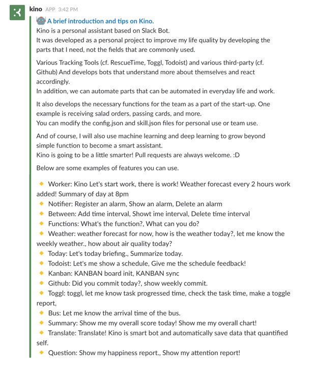
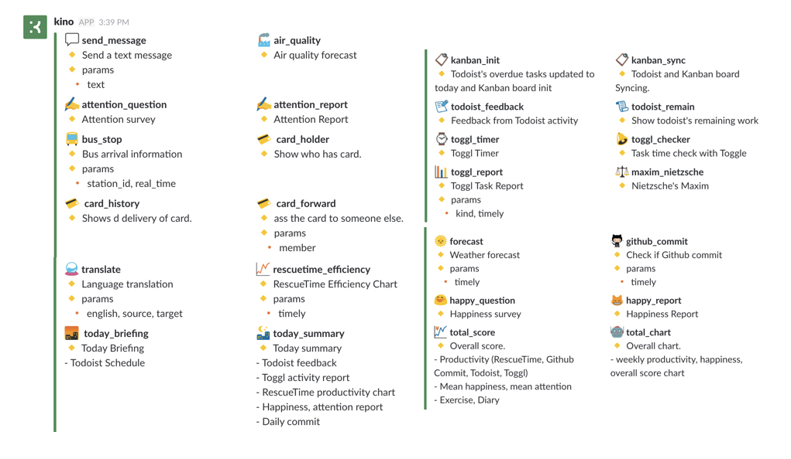
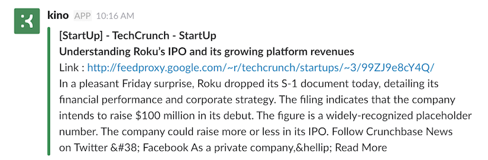
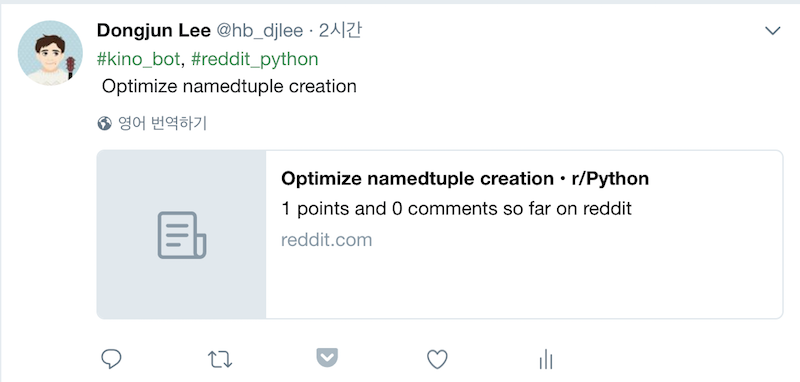

  

  <strong>
    Personal Assistant Based on Slack Bot for Developer  
    Suitable for personal or small teams
  </strong>

  
  
  
  
  
  
   
  
  
  
  
  
   
  
  
  
  

### Publication

 - SlideShare : [Slideshare - Kino - My Personal Assistant (개인용 Slack Bot을 통한 Quantified Self 프로젝트)](https://www.slideshare.net/DongJunLee6/kino-my-personal-assistant-slack-bot-quantified-self)

## Introduce
 

## Simple Architecture

## Guide & Install

- Can be found at [install.md](install.md).

## Prerequisites

- **[Slack](https://slack.com/)**
- **Python 3.6**
- [API TOKENs](#integrate-open-api-list)

## Features

- Support Languages (Korean, English)

### 0. Scheduler (background job)

As a basic feature, you can add tasks in the time interval you set.
The types of jobs available are as follows.

- **Specific time** ex) Kino there is work! Give me a today briefing at 8am.
- **Repetition cycle** ex) Kino there is work! question happiness every 67 minutes!

n addition, **time interval** can be added and deleted, **alarm** also can be added and deleted.
Add **skill** to the alarm at the end to see what will happen to the schedule.

### 1. Skills

Various skills can be implemented and used. The skills that have been implemented and used so far are as follows.

### 2. Tracking

#### 2-1 Sleep Time

Slack receive a log showing user's status. (active / away)  
Through this log, sleep time is estimated using the last time away and the morning active time.
For developers, it is assumed that the beginning and end of the day will be with the computer!

#### 2-2 Working Hour
- Requirements : [IFTTT](https://ifttt.com)

You can give the IFTTT a Trigger on your Android Device. It is also possible to connect to or disconnect from a specific Wifi. The principle is simple. Start working if you connect to the company's network. At the end of the night, the most disconnected time is the time you leave.

#### 2-3 Task (Kanban)

Kanban, a method of agile, can be used in conjunction with Todoist, Toggl, and Trello.

- Doing : Start task (toggl timer automatic start)
- Break : Stop task (toggl timer automatic stop)
- Done : Stop task (toggl timer automatic stop & todoist task complete)

When the work is done, the attention is checked.

#### 2-4 Happy & Attention Score

I set it up to repeat happiness at regular intervals.
You can enter your score with a total score of 100, and you can calculate your happiness report and your overall score based on it.

### 3. Total Score

Kino's primary mission is to collect data about yourself and to improve your quality of life through the data.  
Here are the criteria that work here:  

- Sleep time 7 hours ~ 9 hours
- Happiness score
- Productivity score (Todoist, Toggl, Github (commit), RescueTime
- Diary
- Exercise
- Repeated tasks (listening to lectures, reading good articles, reading books, etc.)

Give a percentage for each score and give the final score for today's day.  
ex) Total Score = sleep(20) + attentions(20) + happy(30) + productivity(30) + diary(5) + exercise(5) + repeat(10)

### 4. Webhook
- Requirements : [IFTTT](https://ifttt.com) or Custom Webhook [kino-webhook](/kino-webhook) for RealTime (IFTTT is not real time.)

Information that can be found in connection with IFTTT.

- When departing / arriving at a specific place (house, company)
- When new Tweet comes up
- When Google Event is added
- Google Event started 15 minutes ago
- When Task is added to Todoist
- When Todoist completed Task
- When you bookmark an article you want to read correctly on Pocket
- When you get a day summary from RescueTime

You can connect these various cases to Kino to receive notifications.

### 5. Channel

If you use kino for personal use, you will use the channel for each purpose.

- \#feed : You will be notified when a new post is posted about the registered feed. cf) [awesome-feeds](https://github.com/DongjunLee/awesome-feeds)
- \#general : default channel
- \#report : Channel for reports on data collected by Kino
- \#sns : Twitter, Facebook, Instagram and etc.. SNS service channel
- \#task : A channel that receives notifications about content related to the task. (Todoist, Toggl, Trello and etc..)

### 6. Feed

Kino notify latest feed what you setting. default feed config is [Awesome Feeds](https://github.com/DongjunLee/awesome-feeds).  
Also can integrate [Twitter](https://twitter.com/) to tweet latest feed. ex) **@hb_djlee**

- **feed**

- **twitter**

## Integrate Open API List

- **Github**
	- [PyGithub](https://github.com/PyGithub/PyGithub)
- **GIPHY**
	- [GIPHY](https://giphy.com/)	
- **Weather**
	- [python-forecast.io](https://github.com/ZeevG/python-forecast.io)
	- [geoopy](https://github.com/geopy/geopy)
- **Todoist**
	- [todoist-python](https://github.com/Doist/todoist-python)
- **Toggl**
	- [TogglPy](https://github.com/DongjunLee/TogglPy) forked from [matthewdowney/TogglPy](https://github.com/matthewdowney/TogglPy)
- **Trello**
	- [py-trello](https://github.com/sarumont/py-trello)
- **Twitter**
	- [python-twitter](https://github.com/bear/python-twitter)
- **RescueTime**
- **공공데이터 버스도착정보**
- **공공데이터 대기질정보**
	- [airkoreaPy](https://github.com/DongjunLee/airkoreaPy)
- **Naver 기계번역**
