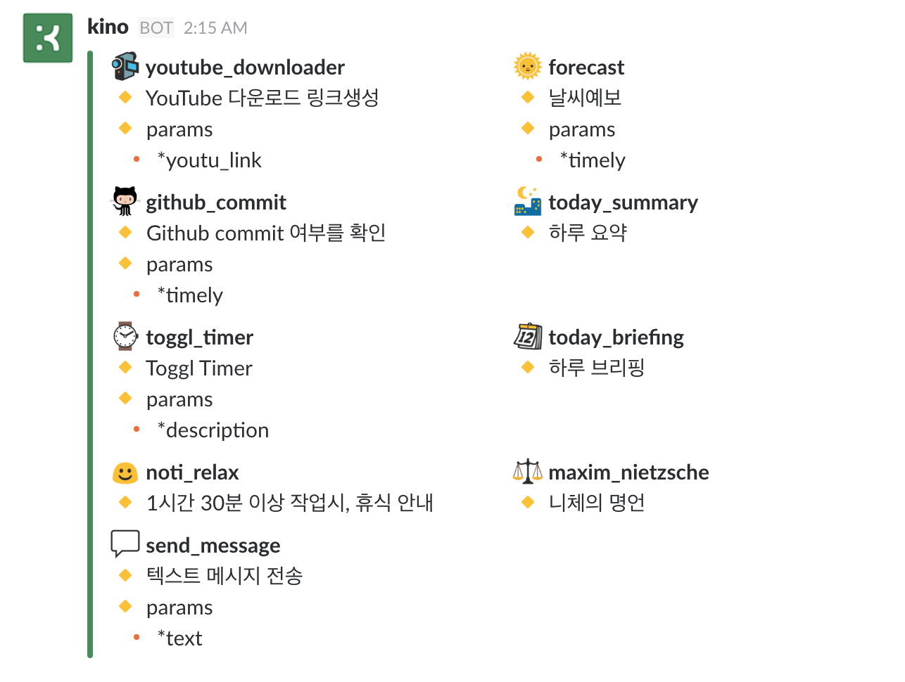

  

  

<h1 align="center"> kino-bot </h1>
<h3 align="center">
  <strong>
    A.I Personal Assistant Based on Slack Bot
  </strong>
</h3>

  
  
  

## Introduce
 
 Kino는 Slack Bot으로 기본으로 개발된 Personal Assistant A.I 입니다. 일반적으로 사용되는 분야가 아닌, 저에게 필요한 부분들을 개발하여 저 자신의 삶의 질을 높이기 위한 개인 프로젝트 (BeHappy 프로젝트) 입니다. 다양한 Tracking Tool들 (cf. [RescueTime](https://www.rescuetime.com/), [Toggl](https://toggl.com/), ) 및 다양한 서드 파티(cf. [Github](https://github.com/) 와 연동하여 자신에 대해서 더 자세히 파악하고 그에 맞는 반응을 하는 봇을 개발합니다. 
 
 물론 머신러닝과 딥러닝도 사용하여 단순한 기능 연동을 넘어서 똑똑한 비서로서 성장시킬 것 입니다.

## Prerequisites

- **Personal [Slack](https://slack.com/)**
- **Python 3.5**
	- [asyncio](https://docs.python.org/3/library/asyncio.html)
	- [slacker](https://github.com/os/slacker)
	- [konlpy](http://konlpy.org/en/v0.4.4/)
	- [schedule](https://github.com/DongjunLee/schedule)
- **Github**
	- [PyGithub](https://github.com/PyGithub/PyGithub)
- **Weather**
	- [python-forecast.io](https://github.com/ZeevG/python-forecast.io)
	- [geoopy](https://github.com/geopy/geopy)
- **Todoist**
	- [todoist-python](https://github.com/Doist/todoist-python)
- **Toggl**
	- [TogglPy](https://github.com/DongjunLee/TogglPy) forked from [matthewdowney/TogglPy](https://github.com/matthewdowney/TogglPy)	

## Guide

## Features

