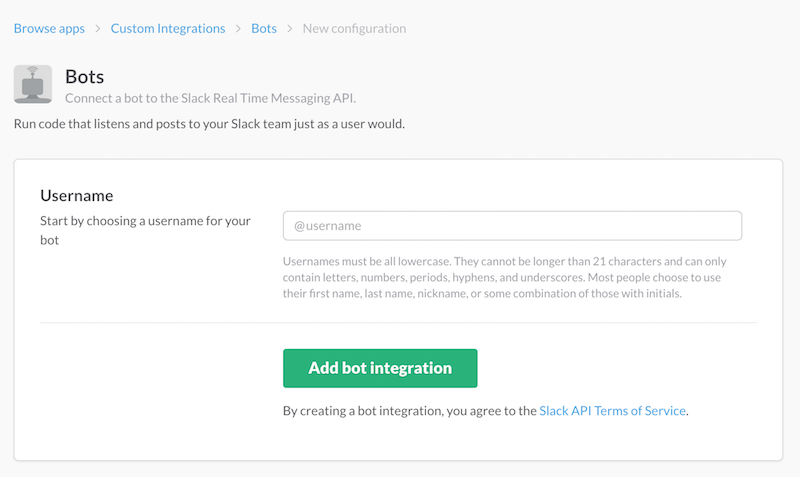

## Install


1. 가상환경을 Python3.6으로 셋팅
	- [참고 Link](http://python-guide-pt-br.readthedocs.io/en/latest/dev/virtualenvs/#virtual-environments)

2. 관련 package들을 설치
	- ```pip install -r requirements.txt```  

3. 다음으로 개인용 슬랙에 Bot을 먼저 추가합니다.
	-  [Custom Integraions New Bot Link](https://my.slack.com/services/new/bot)
	   
	-  channel을 만들고 만든 봇을 invite 합니다.

4. 가장 기본이 되는 Bot의 Token 값을 config.json에 넣어줍니다.
	- data/config.json <-- Bot에 사용되는 환경에 필요한 값들 

5. 가장 바깥에 있는 main.py 를 이용해 실행!  
	- ```python main.py```


## Guide

1. **config.json** Setting.
	- **config_example.json** 에서 Bot에 대한 설정값 입력 후 **config.json** 으로 변경.
	- bot : 봇에 대한 기본설정 (bot\_name, master\_name)
	- slack : token, default_channel 설정
	- profile : 잠자고 일어나는 시간설정, 집, 일하는 장소 설정, todoist task시간 설정, 종합점수에 사용되는 점수비율 설정
	- open\_api : 각 open_api에 필요한 값들을 설정해줍니다.

2. **skills.json**
	- 사용하는 스킬에 대한 설정들을 저장하는 파일입니다.
	- 각 스킬의 key 값는 functions.py에 코딩한 함수과 이름이 동일해야 합니다.
	- keyword :  컬럼은 패턴매칭에 사용되는 문장 혹은 단어를 넣어놓습니다.
	- params : 각 스킬에 필요한 파라미터를 정의.
	- description : 스킬에 대한 설명
	- icon : 스킬에 대한 아이콘

3. **ner.json**
	- Named Entity Recognizer 에 사용되는 값들이 저장되어 있습니다.
	- 여기서 list는 **keyword**와 같이 동작하고, str타입은 **Regex**으로 동작합니다.

이상으로 간단한 설명입니다.   
더 설명이 필요한 부분이 있으면 Issue에 올려주도 좋고, 메일을 주셔도 좋습니다^^

## OPEN API

1. [Github](https://github.com/) : 일일 커밋, 생산성 점수에 사용
2. [Dark Sky](https://darksky.net/) : 날씨 예보
3. [Todoist](https://ko.todoist.com/) : To do list 용 App
4. [toggl](https://toggl.com/) : 타이머 기능
5. [Trello](https://trello.com/) : 칸반 보드
5. [Rescue Time](https://www.rescuetime.com/): 컴퓨터에서의 사용기록을 진단해준다.
6. [gbis](http://www.gbis.go.kr/gbis2014/publicService.action?cmd=openApiInfo) : 경기버스 도착시간 조회
7. [airkorea](https://www.airkorea.or.kr/) : 공기질, 미세먼지 예보
8. [Naver](https://developers.naver.com/docs/common/apilist/) : 네이버 오픈 API (현재는 기계번역) 